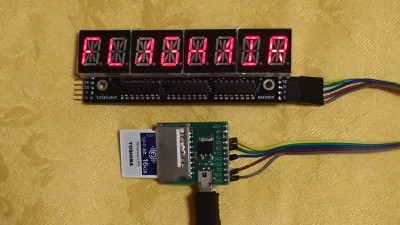

# Lua library for 14SEGx8 display module with 74HC595 x 3  for FlashAir.

これはFlashAirで Hideshi Maeno さん作の 8桁14セグLED基板 を制御するためのライブラリです。  
FlashAir W-04のファームウェア v4.00.03以降で動作します。  

このライブラリは、Hideshi Maeno さんの下記コードをベースにしています。
https://github.com/maenoh/led-14seg/blob/add-new-file/14SEGx8v3_makerfaire2019_dynamic.ino

8桁14セグLED基板の情報は以下をご参照ください。
http://maenoh.blog.fc2.com/blog-entry-28.html

## インストール方法  

    lib/Slib14SEGx8v3.lua  -- ライブラリ  
    sample.lua             -- サンプルプログラム  
上記をFlashAir内の好きな場所においてください  

## FlashAirと8桁14セグLED基板のつなぎ方  

8桁14セグLED基板の電源は +5Vです。
FlashAirと共通の3.3V電源でも動作するようですが、保証の限りではありません。

FlashAir(Pin#) | 圧電サウンダ | 備考
--- | --- | ---
CLK (5) |--- | Pull-down(10korm) to GND
CMD (2) |SI  |
DAT0(7) |SK  |
DAT1(8) |RK  |
DAT2(9) |--- |
DAT3(1) |--- |
VCC (4) |--- | 2.7～3.6V
VSS(3,6)|G   | GND
5V      |V   | 5V

## Slib14SEGx8v3.lua の関数の説明  

関数 | 説明  
--- | ---  
Slib14SEGx8:setup(n_disp,led_type) | **FlashAirの端子をSPIに切り替えて、表示をクリアします** **n_disp:**8桁14セグLED基板の接続個数 **led_type:**LEDのタイプ。1:カソードコモン(AS),2:アノ－ドコモン(BS)。省略時は2。
Slib14SEGx8:getPat(str) | **文字列に対応するLEDの表示パタンを取得します** **str:**文字列。大文字英数字および記号が使えます
Slib14SEGx8:write(fg,mask,bg) |***表示パタンをLEDに転送します*** maskやbgを設定することでビットパタン合成が可能です。<bg>転送パタン＝(bgパタン and maskパタン）or fgパタン **fg:**foregroundパタン **mask:**マスクパタン **bg:**backgroundパタン
Slib14SEGx8:print(str) | **文字列に対応する表示パタンをLEDに転送します** **str:**文字列。大文字英数字および記号が使えます

## サンプルコード  

sample.lua          -- 文字列を表示します

## Author  

[GitHub/AoiSaya](https://github.com/AoiSaya)  
[Twitter ID @La_zlo](https://twitter.com/La_zlo)  
